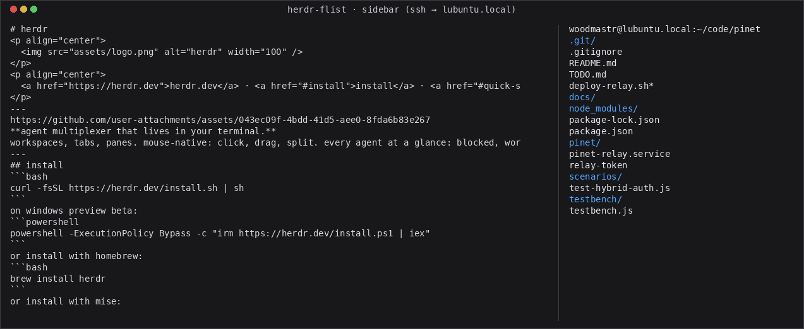

# Filelist Row

Python Herdr plugin that opens a filelist row under the focused pane and follows
its working directory — locally and over SSH.

<p align="center">
  
</p>

The row follows the focused pane. Over SSH it parses the remote cwd from the
focused pane's own shell prompt, so it tracks `cd` into subdirectories on the
remote host.

## Setup

Requires `uv` (runs the single-file script with PEP 723 metadata; a plain
`python3 filelist.py` also works). SSH panes need passwordless key auth to the
remote host (`ssh-copy-id`), since the remote listing runs non-interactively with
`BatchMode=yes`.

Install locally while developing:

```sh
herdr plugin link .
```

Or install from GitHub once published:

```sh
herdr plugin install devskale/herdr-flist
```

## Behavior

Running the `open` action splits the focused pane to the right (without
stealing focus) and renders a live listing of the focused pane's cwd. The pane
self-narrows to a sidebar width on startup, so it docks as a right column rather
than a 50/50 split:

```sh
herdr plugin action invoke open --plugin herdr-flist
```

- Local panes: the cwd comes from Herdr (OSC 7). Entries are dirs-first,
  colorized by type, and tagged with git status (`+new` `-del` `~ren`
  `?untracked` `!conflict`).
- SSH panes: Herdr drops remote-host cwd reporting, so the remote cwd is parsed
  from the focused pane's own shell prompt and listed over `ssh`. This is what
  lets the view follow the remote shell into subdirectories.

The pane is a normal Herdr pane after creation. The plugin does not clean it up
or manage its lifecycle.

Optional keybind:

```toml
[[keys.command]]
key = "prefix+f"
type = "plugin_action"
command = "herdr-flist.open"
description = "open filelist row"
```

## Notes

- Single file, no pip dependencies: `filelist.py` (run via `uv run`, PEP 723
  inline metadata declares `requires-python = ">=3.9"` and no deps).
- Recognizes common prompt shapes: `user@host:~/path$`, bare `~/path$`, `/path>`.
- Tunables (environment variables): `HERDR_FILELIST_WIDTH` (sidebar width
  fraction, default `0.3`; `0` disables self-sizing), `HERDR_FILELIST_INTERVAL`
  (poll seconds, default `1`), `HERDR_FILELIST_REMOTE_CACHE` (`3`s),
  `HERDR_FILELIST_SSH_TIMEOUT` (`5`s).

`PLUGINS.md` is a field guide to the Herdr plugin model built around this plugin
— manifest contract, injected environment, where pane cwd comes from, and the
SSH cwd gap that motivated the prompt-parsing approach.

herdr-flist is a community plugin, not part of Herdr itself.
